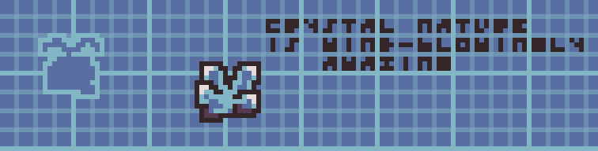

##  Emptiness Umm  
Imagine being in the middle of absolute emptiness, just you and... and **Curl**, your friend, a crystal. The life of crystals is truly fun and carefree. They just walk around and look into the void, just like you. He has you, and you have him. I think this is love.

##  Installation
The installation is incredibly simple. If you can't find the build archive in the repository or on the website, you can compile it yourself. For this, you need `SFML`.

> [!IMPORTANT]
> You need SFML to compile it manually. Otherwise, you’ll get compilation errors.

Let's move on to the build process for different systems. I'll show you how to do it.

### MacOS  
We quickly build it by running a script. After that, a `Bin` folder will be created, containing both the resource folder and the build itself. There’s also `CMake` available for all systems, which you can use.

```bash
source MacOS.BuildThis.sh
```

> [!IMPORTANT]
> Make sure to check the terminal for any errors or anything that might interfere with the process.

Now just run the build file if you're in the root folder of the project:

```bash
./BuildScripts/Bin/BuildOutput.bin
```

Or if you're already in the `Bin` folder that was created:

```bash
./BuildOutput.bin
```

##  License  
The license is `Apache License 2.0`, signed by risknu, 2024-2025. See the [License](License) file for details.

---

```
I just enjoy creating this game, I press random things and stare at the screen. The game completely shows how I'm developing it, so just accept it and love it for what it is.  
- risknu
```
